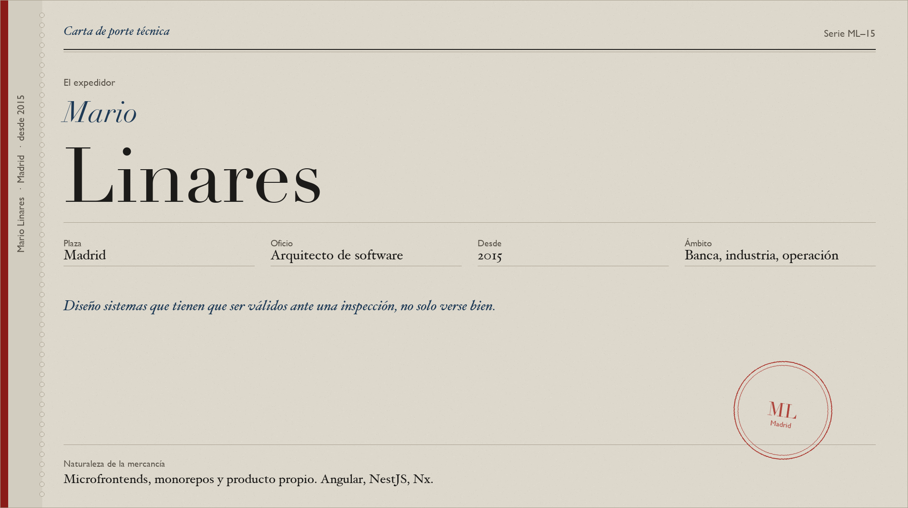
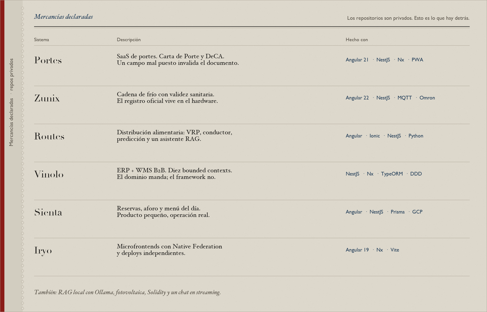
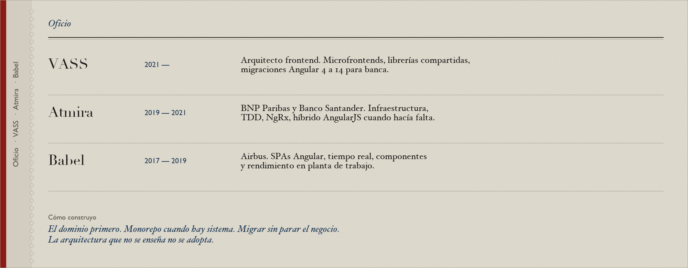
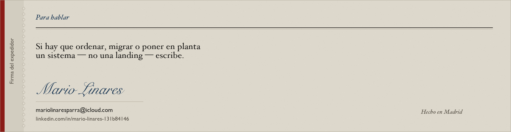

  

  

  

  

  <a href="mailto:mariolinaresparra@icloud.com">mariolinaresparra@icloud.com</a>
  &nbsp;·&nbsp;
  <a href="https://www.linkedin.com/in/mario-linares-131b84146">LinkedIn</a>
  &nbsp;·&nbsp;
  <a href="https://github.com/mariolinares">GitHub</a>

