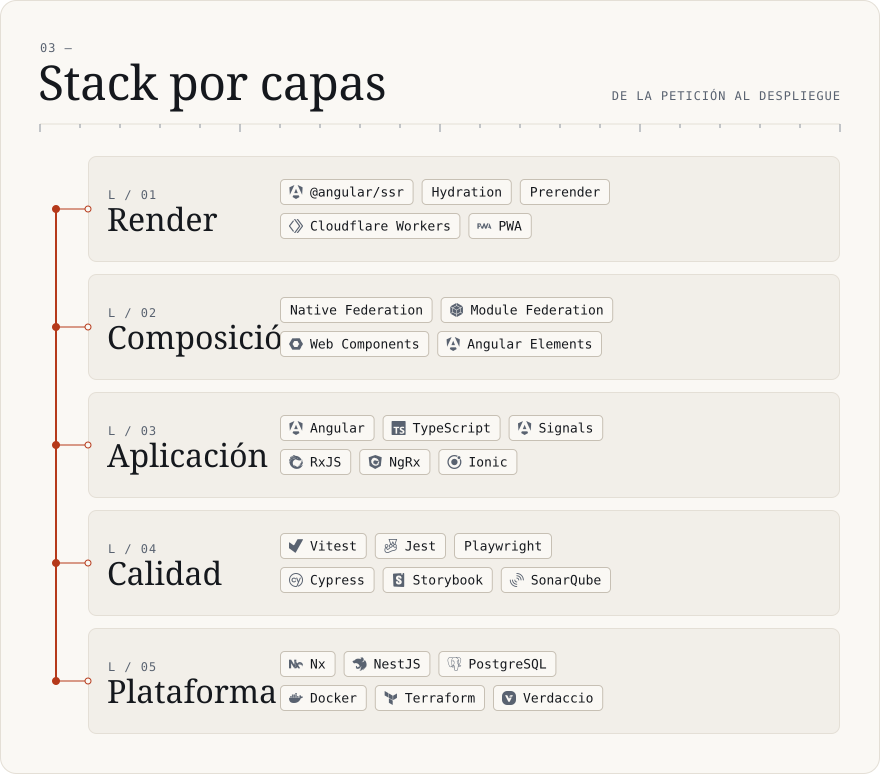
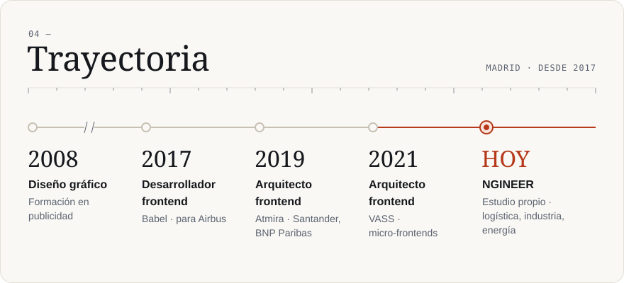
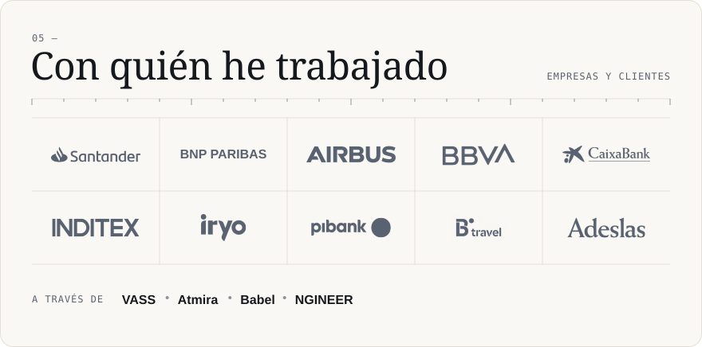

<!-- Generado por tools/build.py desde design/tokens.json y tools/content.py. No editar a mano. -->

<picture>
  <source media="(prefers-color-scheme: dark)" srcset="./assets/hero-dark.svg">
  
</picture>

<picture>
  <source media="(prefers-color-scheme: dark)" srcset="./assets/modulos-dark.svg">
  
</picture>

Experimentos públicos sobre SSR y Native Federation: [angularssr-host](https://github.com/mariolinares/angularssr-host) shell SSR que resuelve remotos federados en servidor · [angularssr-remote](https://github.com/mariolinares/angularssr-remote) remoto federado con render en servidor · [angularnossr](https://github.com/mariolinares/angularnossr) remoto solo cliente, con fallback en el host.

<picture>
  <source media="(prefers-color-scheme: dark)" srcset="./assets/principios-dark.svg">
  
</picture>

<picture>
  <source media="(prefers-color-scheme: dark)" srcset="./assets/capas-dark.svg">
  
</picture>

<picture>
  <source media="(prefers-color-scheme: dark)" srcset="./assets/trayectoria-dark.svg">
  
</picture>

<picture>
  <source media="(prefers-color-scheme: dark)" srcset="./assets/clientes-dark.svg">
  
</picture>

<picture>
  <source media="(prefers-color-scheme: dark)" srcset="./assets/contacto-dark.svg">
  
</picture>

  <a href="mailto:mariolinaresparra@icloud.com">mariolinaresparra@icloud.com</a>
  &nbsp;·&nbsp;
  <a href="https://www.linkedin.com/in/mario-linares-131b84146">LinkedIn</a>

Paneles dibujados con un sistema de diseño propio: tokens, Instrument Serif, Instrument Sans y DM Mono (OFL) incrustadas, marcas de Simple Icons (CC0) y un generador en Python. Las marcas pertenecen a sus propietarios. Siguen el tema claro u oscuro de tu GitHub.

